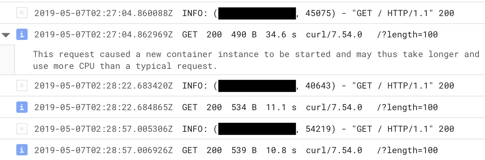

# gpt-2-cloud-run

App for building a text-generation API for generating text from [OpenAI](https://openai.com)'s [GPT-2](https://openai.com/blog/better-language-models/) via [gpt-2-simple](https://github.com/minimaxir/gpt-2-simple), and running it in a scalable manner *and effectively free* via Google's [Cloud Run](https://cloud.google.com/run/). This app is intended to be used to easily and cost-effectively allow others to play with a finetuned GPT-2 model on another dataset, and allow programmatic access to the generated text.

The base `app.py` runs [starlette](https://www.starlette.io) for async/futureproofness, and is easily hackable if you want to modify GPT-2's input/output, force certain generation parameters, or want to add additional features/endpoints such as tweeting the generated result.

## Demo

You can play with a web-based demo of a Cloud Run API pointing at the default 117M "small" GPT-2 model here: https://minimaxir.com/apps/gpt2-small/

The demo web UI is based off of the `app_ui.html` file in this repo (built on [Bulma](https://bulma.io) and [jQuery](https://jquery.com)) and is designed to be easily hackable to add new features and/or adjust the design (e.g. you can change the URL in the JavaScript function to point to your own Cloud Run API).

## How to Build the Container And Start Cloud Run

Since Cloud Run is stateless without access to local storage, you must bundle the model within the container. First, download/clone this repo and copy the model into the folder (the model should be in the form of the folder hierarchy `/checkpoint/run1`, which is the case by default for most finetuning scripts)

Then build the image:

```shell
docker build . -t gpt2
```

If you want to test the image locally with the same specs as Cloud Run, you can run:

```shell
docker run -p 8080:8080 --memory="2g" --cpus="1" gpt2
```

You can then visit/`curl` http://0.0.0.0:8080 to get generated text!

Then, tag the image and upload it to the Google [Container Registry](https://console.cloud.google.com/kubernetes/images/list) (note, this will take awhile due to the image size!):

```shell
docker tag gpt2 gcr.io/[PROJECT-ID]/gpt2
docker push gcr.io/[PROJECT-ID]/gpt2
```

Once done, deploy the uploaded image to Cloud Run via [the console](https://console.cloud.google.com/run). **Set Memory Allocated to 2 GB and Maximum Requests Per Container to 1**!

The Cloud Run logs will tell you how the service runs, and the `INFO` log level contains Cloud Run diagnostic info, including the time it takes for a request to run.



## Interacting with the API in Cloud Run

The API accepts both `GET` and `POST` requests, and returns a JSON object with a `text` attribute that contains the generated text. For example, let's say the Cloud Run URL is `http://example.google.com`:

A `GET` request to the API would be `http://example.google.com?length=100&temperature=1.0` which can be accessed by almost any type of client. (NB: Don't visit the API in a web browser, as the browser prefetch may count as an additional request)

A `POST` request (passing the data as a JSON object) is more ideal as it is both more secure and allows non-ASCII inputs. Python example:

```python
import requests

req = requests.post('http://example.google.com',
                    json={'length': 100, 'temperature': 1.0})
text = req.json()['text']
print(text)
```

The UI from `app_ui.html` utilizes AJAX `POST` requests via jQuery to retrieve the generated text and parse the data for display.

## Helpful Notes

* Due to Cloud Run's current 2 GB memory maximum, this app will only work with the 117M "small" GPT-2 model, and not the 345M "medium" model (even if Cloud Run offers a 4 GB option in the future, it would not be enough to support the 345M model).
* Each prediction, at the default 1023 token `length`, will take about 2 minutes to generate (10 seconds per 100 tokens). You may want to consider reducing the `length` of the generated text if speed is a concern and/or hardcapping the `length` at the app-level.
* If your API on Cloud Run is actively processing a request less than 7% of the time (at the 100 millisecond level) in a given month, you'll stay [within the free tier](https://cloud.google.com/run/pricing) of Cloud Run, and the price is $0.10 an hour if the service goes over the free tier. Only the time starting up an instance and processing a request counts as billable time (i.e. the durations in the logs); idle time does not count as billable, making it surprisingly easy to stay within the limits.
* The concurrency is set to `1` to ensure maximum utilization for each user (if a single user is using it and accidently causes another container to spawn, it doesn't matter cost-wise as only requests processing incurs charges, not the number of active containers).
* Memory leaks in the container may cause you to go over the 2GB limit and crash the container after enough text generations. Fortunately, Cloud Run can quickly recover (although the current request will fail), and having multiple containers operating due to low concurrency can distribute the workload.

## If You Want More Power

 If you expect the API to be actively engaged 24/7, need faster response times, and/or want to use the 345M GPT-2 model, you may want to use [Cloud Run on GKE](https://cloud.google.com/run/docs/quickstarts/prebuilt-deploy-gke) instead (and attach a GPU to the nodes + use a `tensorflow-gpu` base for the Dockerfile) and increase concurrency to maximize cost efficiency.

 Additionally, if you plan on making a lot of GPT-2 APIs, you may want to use [Cloud Build](https://cloud.google.com/cloud-build/) to avoid the overhead of downloading/building/reuploading a model. [I have written a short tutorial](/cloud_build.md) on how to get a model trained with Compute Engine built using Cloud Build using the included `cloudbuild.yaml` spec.

## Future Improvements

* Add/test a GPU image

## See Also

[A PyTorch Approach to deploying GPT-2 to Cloud Run](https://medium.com/datadriveninvestor/deploy-machine-learning-model-in-google-cloud-using-cloud-run-6ced8ba52aac)

## Maintainer/Creator

Max Woolf ([@minimaxir](https://minimaxir.com))

*Max's open-source projects are supported by his [Patreon](https://www.patreon.com/minimaxir). If you found this project helpful, any monetary contributions to the Patreon are appreciated and will be put to good creative use.*

## License

MIT

## Disclaimer

This repo has no affiliation or relationship with OpenAI.